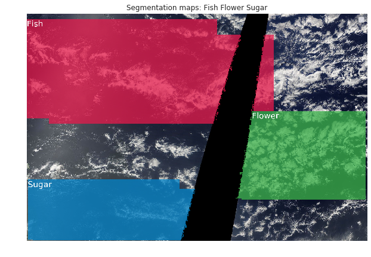

# DL project: Understanding Clouds from Satellite Images

### [Full report](./report/report.pdf)

## Abstract: 
In our project we look at a problem of cloud classification and segmentation. Our goal is to extract which type of clouds are present on a satellite image. To do this we compare popular deep learning approaches for segmentation like U-Net, FPN and DeepLabV3+. Additionally we test out some ideas which are normally used on such problems like: test time augmentation, classifiers as false positive detectors, grid based threshold search etc. We compare this methods based on Dice coefficient and come to the conclusion that original U-Net architecture with ResNet-50 as a backbone performs the best with Dice=0.654.

## Data:
Our data contains 5546 train and 3698 test images ([link](https://www.kaggle.com/competitions/understanding_cloud_organization/data)). There are 4 possible cloud formations on each image: Fish, Flower, Gravel and Sugar. For each image in the test set we have to segment the region of each cloud formation type where each image has at least one cloud formation and up to all four.

## Conclusion:
Cloud formation segmentation and classification from satel-
lite images is an important task for improving weather predic-
tion models and keeping track of the environment. We look
at some of the popular deep learning approaches for solv-
ing this task like U-Net, FPN and DeepLabV3+ models. We
compare the effect of adaptive threshold searching, model’s
backbones, test time augmentations, classifiers as a false pos-
itive filter and custom resizing modules. We evaluate them in
terms of Dice coefficient, which is computed on a hidden test
set. Our findings show that the original U-Net architecture
with ResNet-50 backbone outperforms all other approaches.

  

Example segmentation

